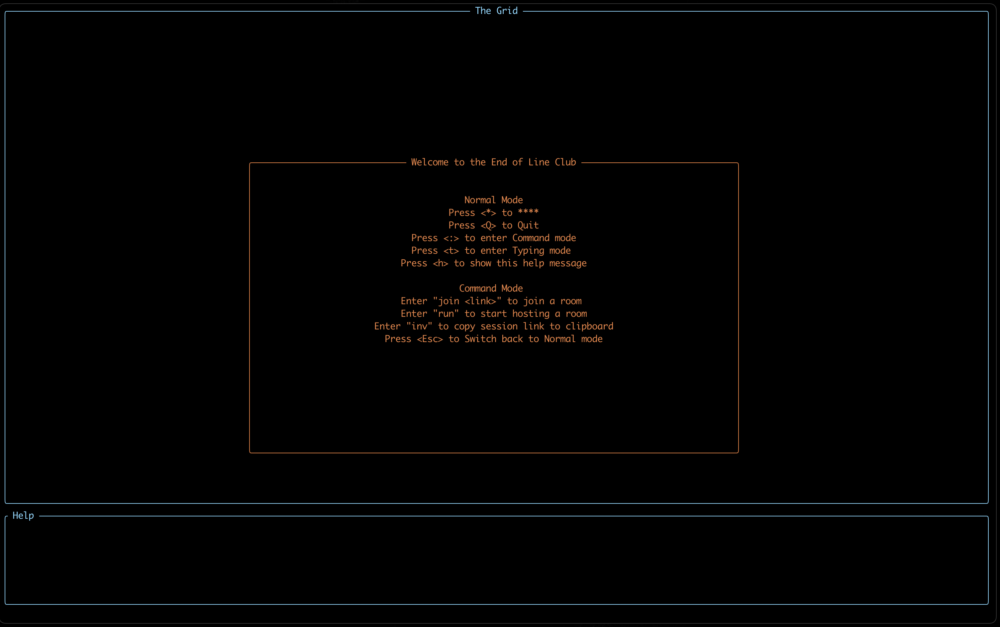
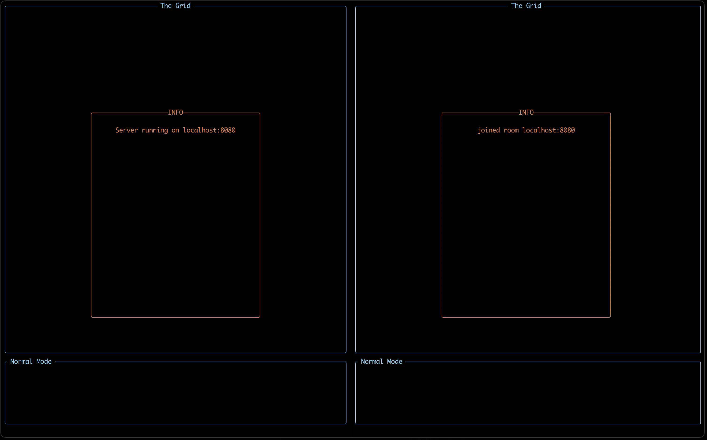
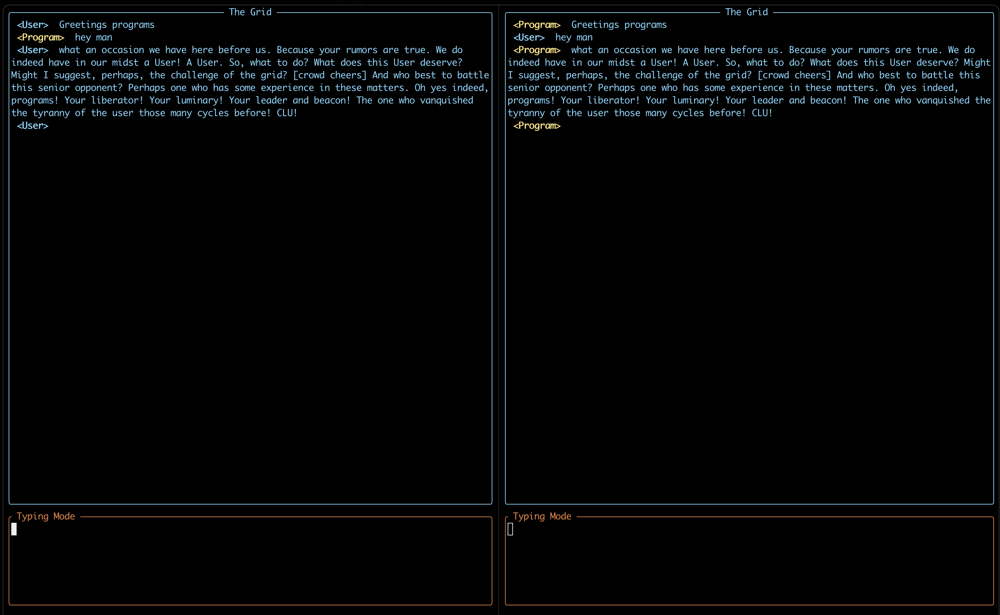

# Endl-rc

The End of line TUI relay chat app.

The idea is to create a simple app for private chatting using network sockets and a lightweight UI client.

## Preview

Main UI

Connections

Chatroom

## Disclaimer
This project is still under development, there is a lot to be done for this to be used in production. For now you can play around, or consider contributing!
